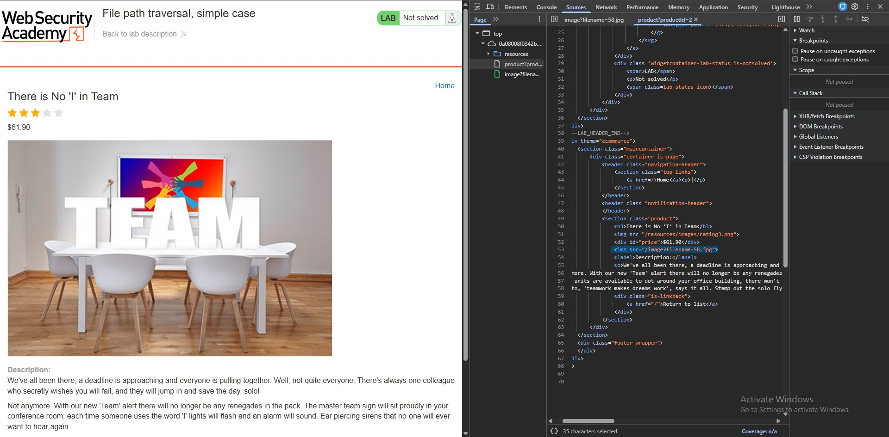
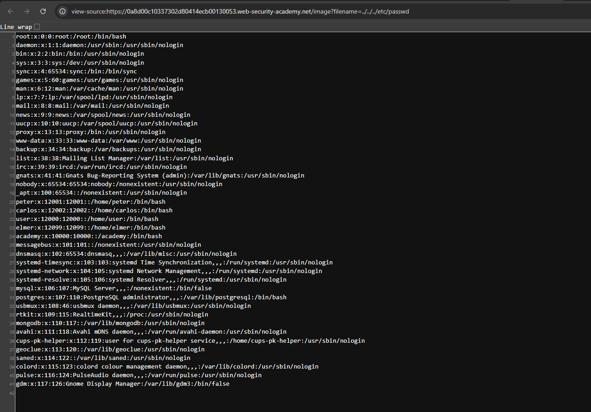
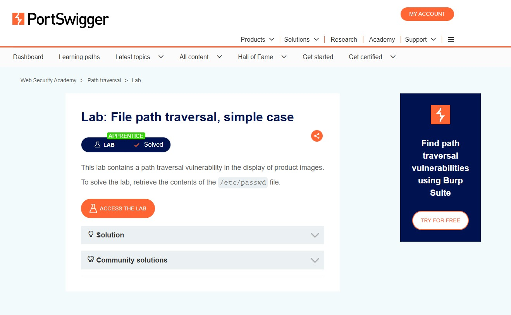
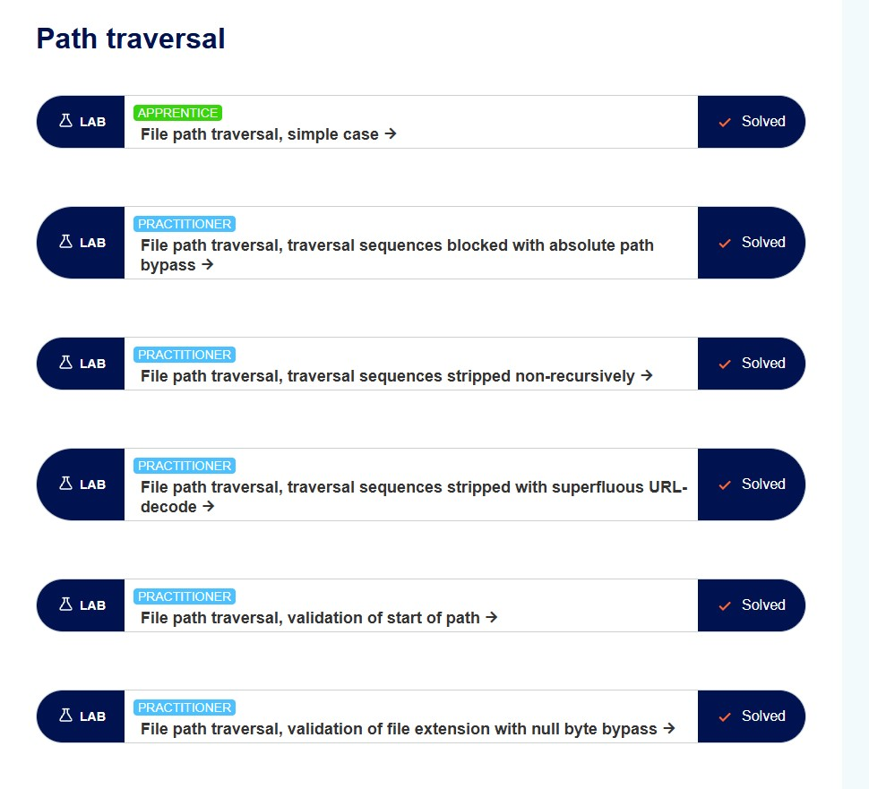

# Incident Analysis 001 - Windmill Path Traversal (CVE-2026-29059)

## Metadata

| Field | Details |
|--------|---------|
| **Title** | Windmill Unauthenticated Path Traversal |
| **CVE** | CVE-2026-29059 |
| **Severity** | High (CVSS 7.5) |
| **Category** | Path Traversal |
| **Published** | 22 July 2026 |
| **Status** | Actively Exploited |
| **Source** | The Hacker News |

---

## Incident

Organizations running vulnerable Windmill instances were targeted through an unauthenticated path traversal vulnerability that allowed attackers to read arbitrary files from the underlying server. More than 170 internet-exposed systems across 24 countries remained vulnerable because administrators failed to apply the security patch released by Windmill.

The vulnerability allowed attackers to retrieve sensitive files without authentication, potentially exposing credentials, configuration files, API keys, and other confidential information.

---

## Threat Analysis

### Threat Actor

An external attacker with no authentication attempting to obtain unauthorized access to sensitive files hosted on vulnerable Windmill servers.

### Attack Objective

- Read arbitrary files from the server
- Collect credentials and configuration files
- Gather information for privilege escalation
- Facilitate additional attacks against the infrastructure

---

## Vulnerability Analysis

The vulnerability existed because user-controlled filename input was not properly validated before being processed.

An attacker could inject directory traversal sequences (`../`) into the filename parameter, allowing the application to escape its intended directory and access arbitrary files anywhere on the server.

Since the vulnerable endpoint required no authentication, exploitation could be performed remotely by anyone with network access.

---

## Exploit Analysis

The attacker manipulates the vulnerable filename parameter by inserting directory traversal sequences.

Example payload:

```text
../../../etc/passwd
```

Instead of retrieving the requested file, the application traverses outside its intended directory and returns the Linux password file.

This demonstrates that the application fails to restrict file access to authorized directories.

---

# Proof of Concept (Educational Demonstration)

> **Note:** The following screenshots were taken from the PortSwigger Web Security Academy Path Traversal laboratory. They demonstrate the same vulnerability class exploited in **CVE-2026-29059** and are included for educational purposes.

---

## Step 1 – Identify the Vulnerable Parameter

The application loads product images using a user-controlled `filename` parameter.

```html

```

The attacker identifies that the filename parameter may be manipulated.



---

## Step 2 – Modify the Request

Instead of requesting an image, the attacker replaces the filename with directory traversal sequences.

Payload:

```text
../../../etc/passwd
```

The traversal sequences move outside the image directory and request the Linux password file.

---

## Step 3 – Successful Exploitation

The application returns the contents of `/etc/passwd`, confirming that arbitrary files can be accessed.



Evidence observed:

- Linux user accounts
- System service accounts
- Home directories
- Default shells

This confirms a successful directory traversal attack.

---

## Step 4 – Laboratory Verification

After retrieving the sensitive file, the PortSwigger laboratory automatically marks the challenge as solved.



---

## Additional Practice

To strengthen understanding of directory traversal attacks, additional PortSwigger laboratories covering common bypass techniques were completed.

Completed labs include:

- File path traversal – Simple case
- Traversal sequences blocked with absolute path bypass
- Traversal sequences stripped non-recursively
- Traversal sequences stripped with superfluous URL decoding
- Validation of start of path
- Validation of file extension using null byte bypass



---

## Relation to CVE-2026-29059

Although the screenshots originate from a controlled training laboratory, the underlying vulnerability is identical in principle to the Windmill vulnerability.

Both vulnerabilities result from improper validation of user-supplied file paths.

In the Windmill incident, attackers exploited an unauthenticated endpoint to perform directory traversal and retrieve arbitrary files from vulnerable servers.

The PortSwigger laboratory demonstrates this attack in a safe environment, making it easier to understand the exploitation process behind CVE-2026-29059.

---

## Risk Assessment

Successful exploitation may lead to:

- Unauthorized disclosure of sensitive files
- Credential exposure
- API key leakage
- Configuration file disclosure
- Privilege escalation
- Further compromise of internal systems
- Data breaches
- Operational disruption
- Financial loss
- Reputational damage

---

## Mitigation Strategy

Organizations should implement the following security controls:

- Upgrade Windmill to the latest patched version.
- Apply security updates immediately after release.
- Validate and sanitize all user-supplied file paths.
- Reject directory traversal sequences (`../`, `..\\`).
- Restrict file access to designated directories.
- Implement allowlists for accessible files.
- Deploy Web Application Firewall (WAF) rules to detect traversal attempts.
- Monitor logs for repeated traversal requests.
- Conduct regular vulnerability assessments and penetration testing.

---

## Lessons Learned

- Timely patch management significantly reduces exposure to known vulnerabilities.
- User-controlled file paths must never be trusted.
- Input validation and canonicalization are essential security controls.
- Monitoring suspicious requests helps identify exploitation attempts early.
- Secure coding practices prevent common vulnerabilities such as directory traversal.
- Practical laboratory exercises provide valuable understanding of real-world attack techniques.

---

## References

1. The Hacker News. **Hackers Exploit Windmill Flaw to Read Arbitrary Server Files Without Authentication** (22 July 2026).  
   https://thehackernews.com/2026/07/hackers-exploit-windmill-flaw-to-read.html

2. Windmill Labs. **Security Advisory – GHSA-24fr-44f8-fqwg (CVE-2026-29059)**.  
   https://github.com/windmill-labs/windmill/security/advisories/GHSA-24fr-44f8-fqwg

3. Windmill Labs. **Release v1.603.3 (Security Fix)**.  
   https://github.com/windmill-labs/windmill/releases/tag/v1.603.3

4. PortSwigger Web Security Academy. **Path Traversal Labs**.  
   https://portswigger.net/web-security/file-path-traversal
